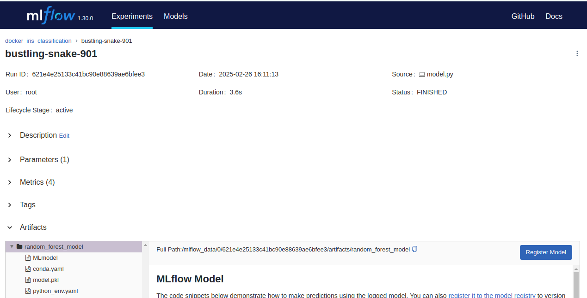
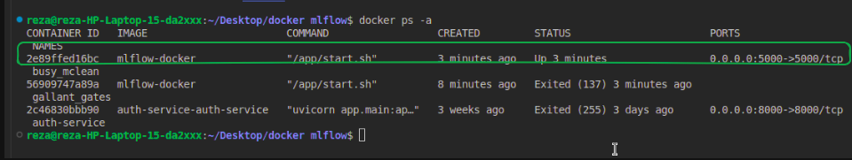

# MLflow Server with Docker Container

This repository contains the necessary files to create a Docker container with an MLflow server.

---

## 🐳 Docker
Docker is an open-source platform that enables developers to automate the deployment, scaling, and management of applications using containerization. Containers package applications and their dependencies into a lightweight, portable unit that can run consistently across different environments. Unlike virtual machines, Docker containers share the host operating system's kernel, making them more efficient and faster to start. This approach ensures consistency, portability, and isolation, which are crucial for modern development workflows, especially in microservices and DevOps practices.

---

## 🚀 Advantages of Containerizing an MLflow Server


### ✅ **Consistency:**
The MLflow server, along with all its dependencies and configurations, is encapsulated in the Docker container. This ensures that the environment is the same no matter where you run it—locally, on a server, or in a cloud environment.

### ✅ **Isolation:**
Running MLflow inside a Docker container keeps it isolated from your local system. This prevents version conflicts and makes managing dependencies much easier.

### ✅ **Portability:**
You can share your Docker container configuration (e.g., the `Dockerfile`) with teammates or deploy it on different platforms without needing to reconfigure MLflow or install dependencies manually.

### ✅ **Easy Setup and Cleanup:**
You can quickly spin up an MLflow server with a single `docker run` command and remove it just as easily without leaving residual files or dependencies on your local machine.

### ✅ **Scalability:**
When combined with other container orchestration tools like Docker Compose or Kubernetes, you can easily scale the MLflow server, integrate it with other services, or deploy it in a production-grade MLOps pipeline.

---

## 🧑‍💻 How to Run the MLflow Server in a Docker Container

### 1. Clone this Repository
```bash
git clone <repository_url>
cd <repository_directory>
```

### 2. Build the Docker Image
```bash
docker build -t mlflow-server .
```

### 3. Run the Docker Container with the MLflow Server
```bash
docker run -p 5000:5000 mlflow-server
```

### 4. Access the MLflow Server
Open your browser and go to:
```
http://localhost:5000
```

---

## 📈 Output

### 🎯 **MLflow UI Output:**
You will see the following interface in the MLflow UI:


### 🖥️ **Terminal Output:**
The terminal will display output similar to this if the docker file creation and running are successful:


---

## 📝 Conclusion
Containerizing an MLflow server with Docker is a powerful way to manage your machine learning experiments and models. It provides consistency, isolation, portability, and scalability, making it easier to share, reproduce, and deploy your ML projects. By following the steps outlined in this guide, you can quickly set up an MLflow server in a Docker container and start tracking your experiments with ease.

